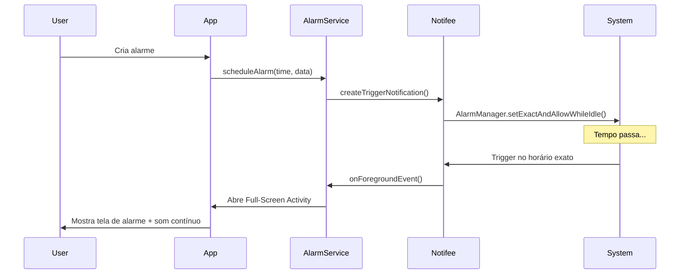
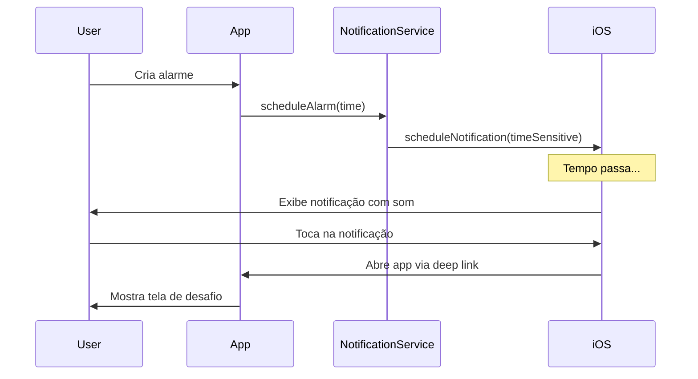

# Foreground Service para Alarmes - Android e iOS

Implementação de um sistema robusto de alarmes que funciona mesmo com o app fechado, garantindo que os alarmes disparem no horário exato.

## User Review Required

> [!IMPORTANT] > **Decisão de Arquitetura Necessária**
>
> Existem duas abordagens principais para implementar alarmes confiáveis:
>
> 1. **Notifee (Recomendado)** - Biblioteca mais completa com foreground service nativo
>    - ✅ Foreground service com notificação persistente
>    - ✅ Full-screen intent para tela de alarme
>    - ✅ Suporte a exact alarms no Android 12+
>    - ❌ Requer native code (não funciona com Expo Go)
>
> 2. **Expo-notifications + Native Modules** - Híbrido
>    - ✅ Mantém compatibilidade com Expo
>    - ⚠️ Requer config plugin customizado para exact alarms
>    - ⚠️ Foreground service precisa de módulo nativo adicional
>
> **Minha recomendação**: Usar **Notifee** para uma experiência de alarme robusta, especialmente no Android.

> [!WARNING] > **iOS Limitações**
>
> O iOS não suporta foreground services como o Android. As alternativas são:
>
> - Critical Alerts (requer aprovação da Apple)
> - Time-Sensitive Notifications (iOS 15+)
> - Sons de notificação (limitado a 30 segundos)
>
> Para um alarme que toca continuamente até o usuário interagir, o app precisa estar aberto.

---

## Análise da Arquitetura

### Android - Foreground Service



### iOS - Time-Sensitive Notifications



---

## Proposed Changes

### Core Services

#### [NEW] [alarm-scheduler.ts](file:///Users/wallysongalvao/Documents/workspace/wakemind/src/services/alarm-scheduler.ts)

Serviço principal para agendamento de alarmes:

```typescript
interface AlarmSchedulerService {
  // Agenda um novo alarme
  scheduleAlarm(alarm: Alarm): Promise<string>;

  // Cancela um alarme existente
  cancelAlarm(alarmId: string): Promise<void>;

  // Reagenda alarme (após edição)
  rescheduleAlarm(alarm: Alarm): Promise<void>;

  // Verifica permissões necessárias
  checkPermissions(): Promise<PermissionStatus>;

  // Solicita permissões
  requestPermissions(): Promise<boolean>;

  // Calcula próximo disparo baseado no schedule
  getNextTriggerTime(alarm: Alarm): Date;
}
```

---

#### [NEW] [notification-handler.ts](file:///Users/wallysongalvao/Documents/workspace/wakemind/src/services/notification-handler.ts)

Handler para eventos de notificação:

```typescript
interface NotificationHandlerService {
  // Inicializa listeners de notificação
  initialize(): void;

  // Handler para quando alarme dispara
  onAlarmTriggered(notification: Notification): void;

  // Handler para ações do usuário (snooze, dismiss)
  onNotificationAction(action: string, alarmId: string): void;

  // Configura categorias de notificação
  setupNotificationCategories(): Promise<void>;
}
```

---

### Android Specific

#### [NEW] [android-foreground-service.ts](file:///Users/wallysongalvao/Documents/workspace/wakemind/src/services/android-foreground-service.ts)

Serviço específico para Android usando Notifee:

```typescript
// Configuração do foreground service
notifee.registerForegroundService((notification) => {
  return new Promise(() => {
    // Mantém o serviço rodando enquanto alarme toca
    // Toca som em loop
    // Vibra continuamente
    // Aguarda ação do usuário
  });
});

// Trigger notification com full-screen intent
await notifee.createTriggerNotification(
  {
    id: alarmId,
    title: 'WakeMind Alarm',
    body: `${alarm.time} ${alarm.period}`,
    android: {
      channelId: 'alarm',
      category: AndroidCategory.ALARM,
      fullScreenAction: {
        id: 'alarm-triggered',
        launchActivity: 'com.wakemind.AlarmActivity',
      },
      sound: 'alarm_sound',
      loopSound: true,
      ongoing: true,
      pressAction: {
        id: 'default',
        launchActivity: 'default',
      },
      actions: [
        { title: 'Snooze', pressAction: { id: 'snooze' } },
        { title: 'Dismiss', pressAction: { id: 'dismiss' } },
      ],
    },
  },
  trigger
);
```

---

### iOS Specific

#### [NEW] [ios-notification-service.ts](file:///Users/wallysongalvao/Documents/workspace/wakemind/src/services/ios-notification-service.ts)

Serviço específico para iOS:

```typescript
// Configuração de categorias com ações
await Notifications.setNotificationCategoryAsync('alarm', [
  {
    identifier: 'snooze',
    buttonTitle: 'Snooze',
    options: { opensAppToForeground: true },
  },
  {
    identifier: 'dismiss',
    buttonTitle: 'Dismiss',
    options: { isDestructive: true },
  },
]);

// Scheduling com time-sensitive
await Notifications.scheduleNotificationAsync({
  content: {
    title: 'WakeMind Alarm',
    body: `${alarm.time} ${alarm.period}`,
    sound: 'alarm_sound.wav',
    categoryIdentifier: 'alarm',
    interruptionLevel: 'timeSensitive', // iOS 15+
  },
  trigger: {
    date: triggerDate,
    channelId: 'alarm',
  },
});
```

---

### Screen Components

#### [NEW] [alarm-trigger-screen.tsx](file:///Users/wallysongalvao/Documents/workspace/wakemind/src/features/alarms/screens/alarm-trigger-screen.tsx)

Tela fullscreen quando o alarme dispara:

**Características:**

- Layout fullscreen sem safe areas
- Hora atual grande e animada
- Animação de pulso/glow
- Botão de Snooze (deslizar para cima)
- Botão de Dismiss → Abre desafio
- Som contínuo e vibração
- Wake lock para manter tela acesa

---

### Configuration

#### [MODIFY] [app.json](file:///Users/wallysongalvao/Documents/workspace/wakemind/app.json)

Configurações necessárias:

```json
{
  "expo": {
    "plugins": [
      [
        "expo-notifications",
        {
          "sounds": ["./assets/sounds/alarm_sound.wav"]
        }
      ]
    ],
    "android": {
      "permissions": [
        "SCHEDULE_EXACT_ALARM",
        "USE_EXACT_ALARM",
        "USE_FULL_SCREEN_INTENT",
        "VIBRATE",
        "RECEIVE_BOOT_COMPLETED",
        "FOREGROUND_SERVICE"
      ]
    },
    "ios": {
      "infoPlist": {
        "UIBackgroundModes": ["audio", "fetch", "remote-notification"]
      }
    }
  }
}
```

---

#### [MODIFY] [AndroidManifest.xml](file:///Users/wallysongalvao/Documents/workspace/wakemind/android/app/src/main/AndroidManifest.xml)

Permissões Android adicionais (se usando config plugin):

```xml
<uses-permission android:name="android.permission.SCHEDULE_EXACT_ALARM" />
<uses-permission android:name="android.permission.USE_EXACT_ALARM" />
<uses-permission android:name="android.permission.USE_FULL_SCREEN_INTENT" />
<uses-permission android:name="android.permission.FOREGROUND_SERVICE" />
<uses-permission android:name="android.permission.RECEIVE_BOOT_COMPLETED" />
<uses-permission android:name="android.permission.WAKE_LOCK" />
```

---

### Store Updates

#### [MODIFY] [use-alarms-store.ts](file:///Users/wallysongalvao/Documents/workspace/wakemind/src/stores/use-alarms-store.ts)

Integração com scheduler:

```typescript
addAlarm: async (alarmInput) => {
  // ... validação existente ...

  const newAlarm = { /* criar alarme */ };

  // Agendar notificação
  const notificationId = await AlarmScheduler.scheduleAlarm(newAlarm);

  set({
    alarms: [...state.alarms, { ...newAlarm, notificationId }],
  });
},

deleteAlarm: async (id) => {
  const alarm = state.alarms.find(a => a.id === id);
  if (alarm?.notificationId) {
    await AlarmScheduler.cancelAlarm(alarm.notificationId);
  }
  // ... resto da lógica ...
},

toggleAlarm: async (id) => {
  const alarm = state.alarms.find(a => a.id === id);
  if (alarm) {
    if (alarm.isEnabled) {
      await AlarmScheduler.cancelAlarm(alarm.notificationId);
    } else {
      await AlarmScheduler.scheduleAlarm(alarm);
    }
  }
  // ... resto da lógica ...
},
```

---

### Hooks

#### [NEW] [use-alarm-permissions.ts](file:///Users/wallysongalvao/Documents/workspace/wakemind/src/hooks/use-alarm-permissions.ts)

Hook para gerenciamento de permissões:

```typescript
export function useAlarmPermissions() {
  const [status, setStatus] = useState<PermissionStatus>('undetermined');

  const checkPermissions = useCallback(async () => {
    // Verifica notificações
    // Verifica exact alarms (Android 12+)
    // Verifica battery optimization status
  }, []);

  const requestPermissions = useCallback(async () => {
    // Solicita permissões necessárias
    // Abre settings se necessário
  }, []);

  return { status, checkPermissions, requestPermissions };
}
```

---

### Dependencies

```bash
# Para Notifee (Android foreground service)
npm install @notifee/react-native

# Já instalado
npx expo install expo-notifications

# Para wake lock
npx expo install expo-keep-awake

# Para som contínuo
npx expo install expo-av
```

---

## Verification Plan

### Automated Tests

```bash
# Testes unitários para alarm-scheduler
npm run test src/services/alarm-scheduler.test.ts

# Testes para cálculo de próximo disparo
npm run test src/utils/alarm-time-calculator.test.ts
```

### Manual Verification

1. **Android - App Aberto:**
   - Criar alarme para 1 minuto no futuro
   - Aguardar disparo
   - Verificar som, vibração e tela fullscreen

2. **Android - App Fechado:**
   - Criar alarme para 2 minutos
   - Fechar app completamente
   - Verificar se alarme dispara

3. **Android - Device Reboot:**
   - Criar alarme
   - Reiniciar dispositivo
   - Verificar se alarme persiste

4. **iOS - Notificação:**
   - Criar alarme
   - Verificar som e badge
   - Testar ações (snooze/dismiss)

5. **Permissões:**
   - Testar fluxo de permissões negadas
   - Verificar comportamento em Android 12+

---

## Implementation Order

1. **Fase 1 - Infraestrutura (1-2 dias)**
   - [ ] Instalar dependências (notifee, expo-notifications)
   - [ ] Configurar permissões no app.json
   - [ ] Criar utils para cálculo de próximo trigger

2. **Fase 2 - Android (2-3 dias)**
   - [ ] Implementar AlarmScheduler com Notifee
   - [ ] Configurar foreground service
   - [ ] Implementar full-screen intent
   - [ ] Testar com app fechado

3. **Fase 3 - iOS (1-2 dias)**
   - [ ] Implementar scheduling com expo-notifications
   - [ ] Configurar categorias e ações
   - [ ] Testar time-sensitive notifications

4. **Fase 4 - UI (1-2 dias)**
   - [ ] Criar AlarmTriggerScreen
   - [ ] Implementar animações
   - [ ] Integrar com desafios

5. **Fase 5 - Integração (1 dia)**
   - [ ] Atualizar store para agendar/cancelar
   - [ ] Implementar reagendamento em edição
   - [ ] Testes end-to-end

---

## Riscos e Mitigações

| Risco                                      | Impacto | Mitigação                                 |
| ------------------------------------------ | ------- | ----------------------------------------- |
| Battery optimization mata o app            | Alto    | Guiar usuário para desabilitar otimização |
| Notifee incompatível com Expo              | Médio   | Usar development build, não Expo Go       |
| iOS Critical Alerts precisa Apple approval | Alto    | Usar time-sensitive como fallback         |
| Android 15 restrições mais agressivas      | Médio   | Seguir guidelines oficiais do Android     |
